## Load your dataset

Upload your dataset to the application. Once uploaded, you can perform various preprocessing steps and analyze your data.

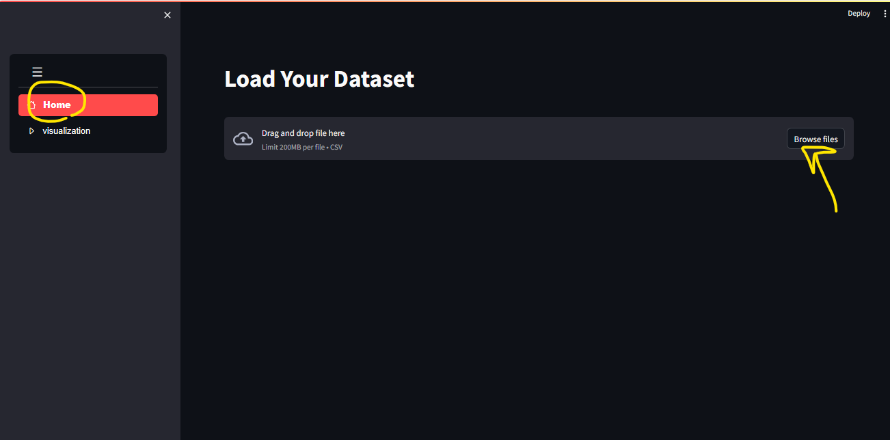
## DataSet:
  -display the dataset 
  -Return to the upload page by pressing the previous button.
    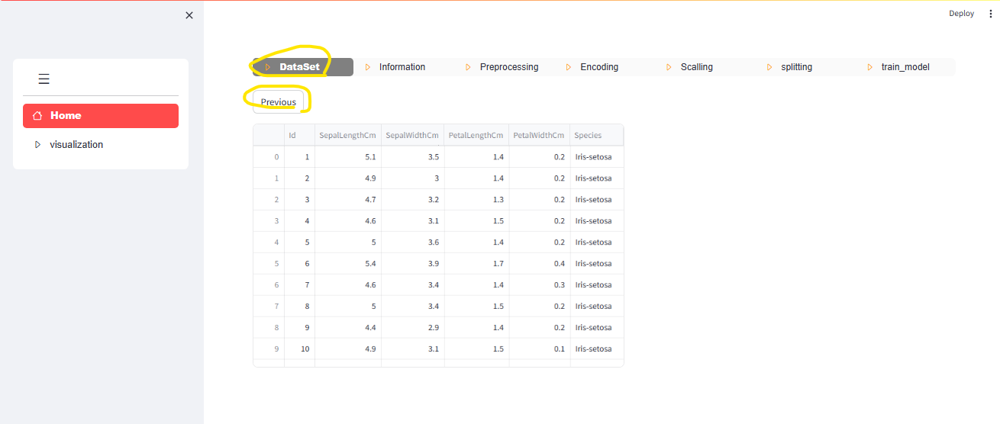

## Information:
  -View information about numeric and non-numeric data in the dataset.
    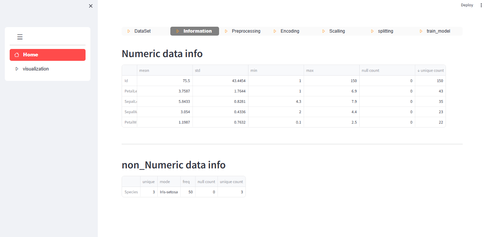 

## Preprocessing:
  -Perform data preprocessing tasks such as deleting empty columns, removing duplicate rows, and filling null values.
  -view information after preprcessing
   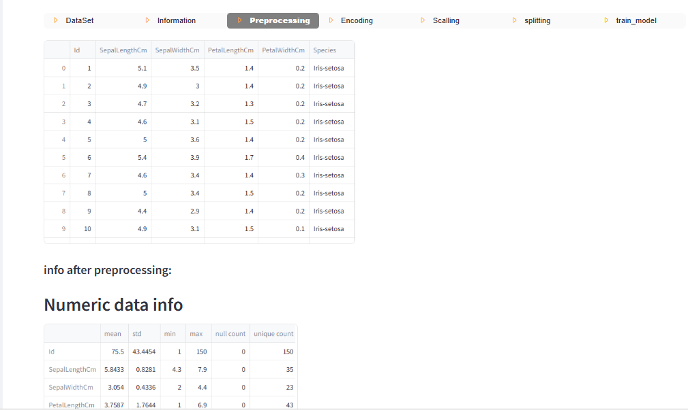

## Encoding:
   -encoding non numeric data 
   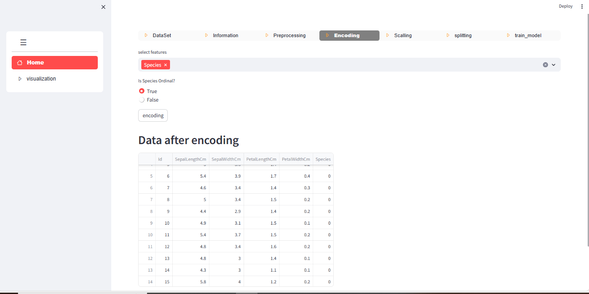

## Scalling:
   -scalling numeric data
    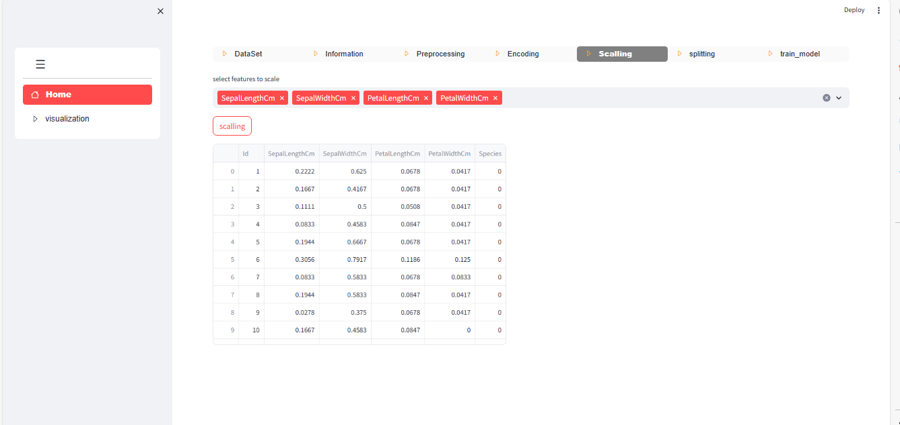
      
## splitting:
- split data into train and test data(must select feature and class)
  
    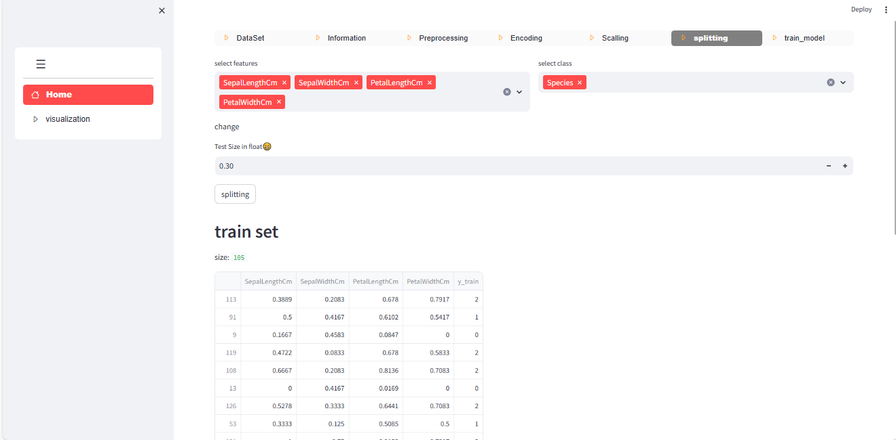
    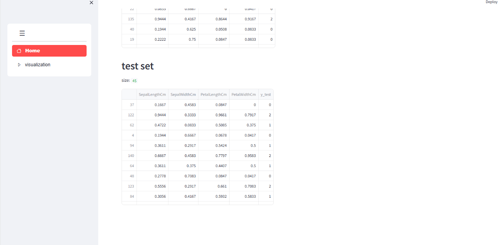

## train multiple models and choose the best one:
  -see different models with different parameters, and the best one

  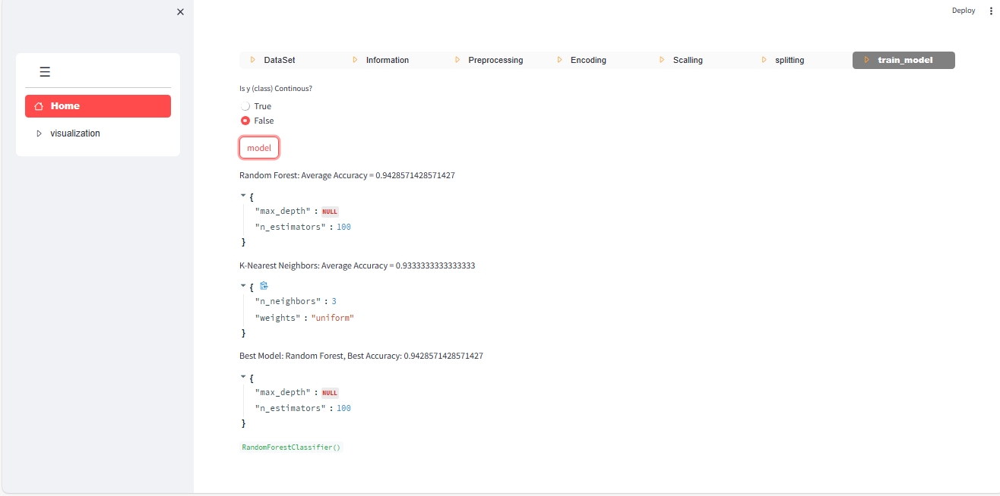
## visualization:
 sow some plot :**plot,histogram,correlation,histogram and distributed in class**

  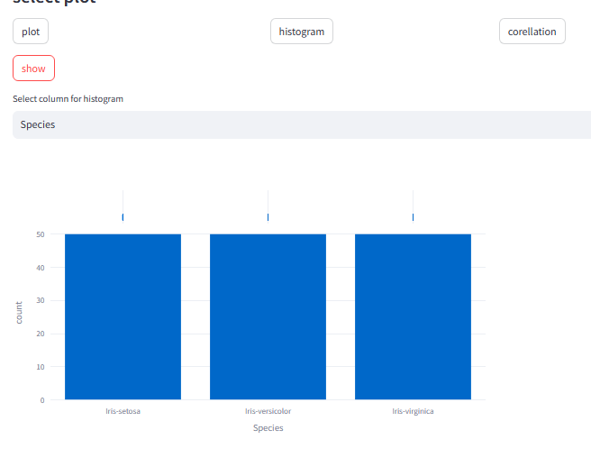
  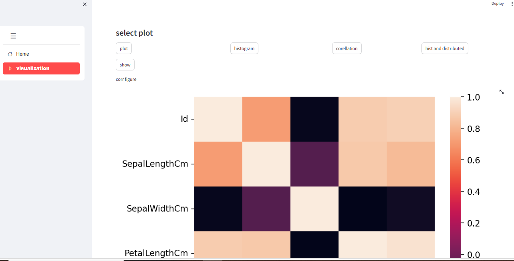
  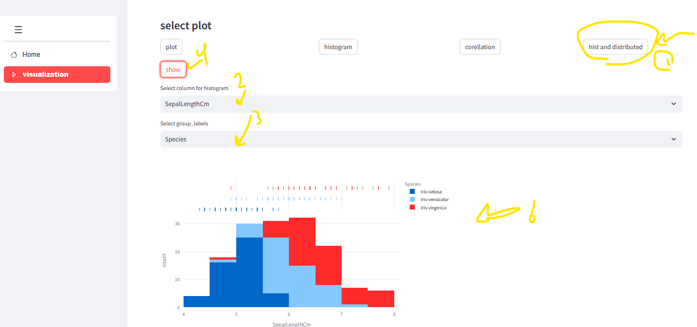